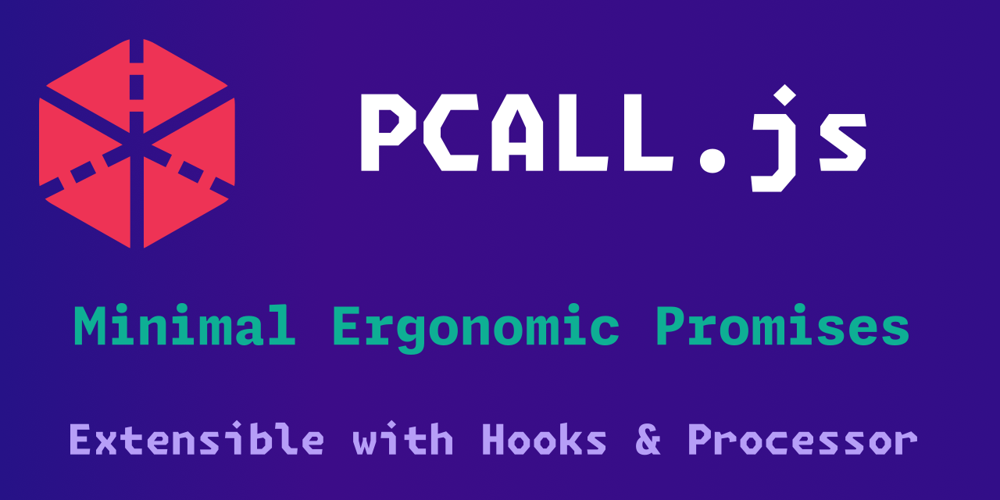

PCALL.js
========

🔥 Protected calls for JS with Superpowers ⚡
--------------------------------------------

<div align=center>
  <b> 🚧 DEVELOPMENT ⛔</b>
</div>

<div align=center>
  <br><br>
  <h3>Centralized your Error handling, Monitoring, Notifications and more</h3>
  <h3>    </h3>
  <b>🔻 no more nested try...catch!</b><br>
  <p><b>Pcall.js</b> is an <b>extendable</b>utility that let you <b>encapsulates asynchronous operations</b> safely</p>
  <br>
  <p><b>Zero dependency</b>, <b>Zero configuration</b>, <b>Lightweight</b>, <b>Framework agnostic</b></p>
</div>

---

Features
--------
- **Zero-dependency:** Works in Node.js (**ESM** & **CJS**) and all modern browsers
- **Zero-configuration:** Provides opt-in configuration for advance usage
- **Fault-tolerant:** Uniform and deterministic asynchronous operations
- **Extendable**: Lifecycle Hooks, Processors, Serializer, Parser
- **Humanized API:** Simple to get started with a reasonable API
- **Lightweight**: under (2 KB)


Intro
-----
`pcall({f}, {arg1}, {...})`
`pcall()` Calls function `{f}` with the given arguments in **protected mode**.
This means that any error inside `{f}` is not propagated;
Instead, `pcall` catches the error and returns a tuple.

Its first element is the status code (a boolean),
which is true if the call succeeds without errors.
And all results from the call, on second element; `[true, {res}]`

In case of any error, pcall returns false plus the error message; `[false, {err}]`

---

Problem
-------
You might have an entire function wrapped in a try..catch;
In which you have figure our which call throw the error.
Lack of control and visibility.

You might wrap each async call in it's own try...catch;
Which is ugly and too verbose.

You might write a utility to wrap an capture each call.

It's fragmented, hacky and not consistent.


Prelude
-------
Having write good amount of [Lua](https://en.wikipedia.org/wiki/Lua_(programming_language)) For various components of my toolchain, like; [AWM](https://awesomewm.org), [nVim](https://neovim.io/), [Alacritty](https://alacritty.org), [Wezterm](https://wezfurlong.org/wezterm)
I've come to love it's simple and convenient approach.


Inspiration
-----------
Lua approach to error handling is simple yet powerful. ^[Lua:8.4](https://www.lua.org/pil/8.4.html), ^[Lua:8.5](https://www.lua.org/pil/8.5.html)

🔹 `Pcall.js` is inspired by Lua `pcall` **with superpowers**!


Installation
------------
```sh
# install
npm install pcall.js
```

Usage
-----
```javascript
// some promise
function clearBit(num, i) {
  return new Promise((resolve, reject) =>
    setTimeout(() => {
      Math.random() > 0.5
        ? resolve(num & ~(1 << i))
        : reject('noop');
    }, 3_000),
  );
}
```

ESM / CJS
---------

```javascript
import pcall from 'pcall.js'
// or
const pcall = require('pcall.js')
```

---

Basic Usage
-----------

```javascript
import pcall from 'pcall.js'

const [ok, res] = await pcall(clearBit, 'hoge', [99, 6], { xorg: 'X11' });

console.log(ok, res)
// <true|false>,  <...>
```

Advance Usage*
-------------

🚧 _NOT_IMPLEMENTED_
```javascript
import Pcall from 'pcall.js'

// Create a custom pcall instance for advance usage
const pcall = Pcall.setup({
  // runs on success, passing context and result
  pass_hook: (ctx, res) => { /* do stuff */ },

  // runs on failure, passing context and error
  fail_hook: (ctx, err) => { /* do stuff */ },

  // runs before success hook, transform the success result
  pass_transformer: (res) => ({ hoge: 'fuga', ...res }),

  // runs before failure hook, transform the failure error
  fail_transformer: (err) => ({ frob: 'xyzzy', err.message })

  // NOTE: the transformers only modify the success/failure message
  // NOT the structure
})

const [ok, res] = await pcall(somePromise, 'hoge', ['fuga', 'nyoro'], { xorg: 'X11' });

console.log(ok, res)
// <true|false>,  <...>
```

Development
-----------
```bash
# run test playground in watch mode
npm run dev

# build production
npm run build

# build stub
npm run build:stub
```

---

TODO
----
- [ ] 🔸Lifecycle Hooks
- [ ] 🔸Transformers for Success/Failure
- [ ] 🔸Serializer
- [ ] 🔸Parser
- [ ] 🔸JSDoc
- [ ] 🔸ESLint
- [ ] 🔸Docs
- [ ] 🔸Tests
- [ ] 🔸Examples

---

License
-------
[MIT](LICENSE)

